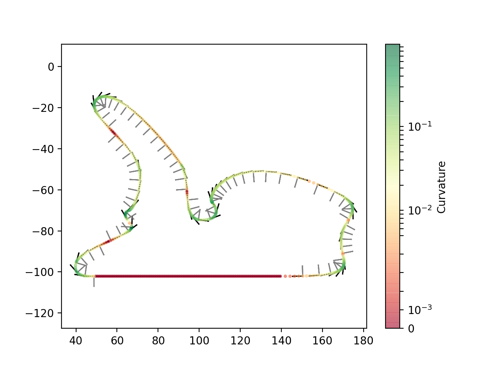

# sympathor - symbolic path extractor

sympathor has compassion with those people trying to obtain a symbolic description of paths described by the [SVG 2 specification](https://www.w3.org/TR/SVG/paths.html).

At reasonable size, sympathor enables you to extract a fully symbolic description of paths from MIME types `text/plain` or `image/svg+xml`. Based on this symbolic description, you can obtain a sampled path for further numerical processing, the path's natural parametrization, its Frenet frame, etc.

In short, sympathor seeks to single-handedly provide properties and quantities of differential geometry at high precision.

## Get started
This little tool is written for Python 3. You can find all dependencies in `requirements.txt` and easily install the package by running `python setup.py install`.

The easiest way to get started with sympathor is by having a look at the examples.
As a motivation, look at the imaginary race track below with its Frenet frame and curvature visualized:

